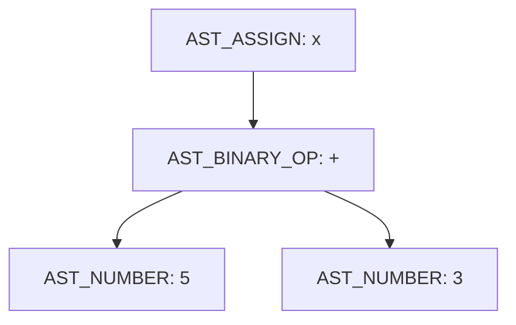
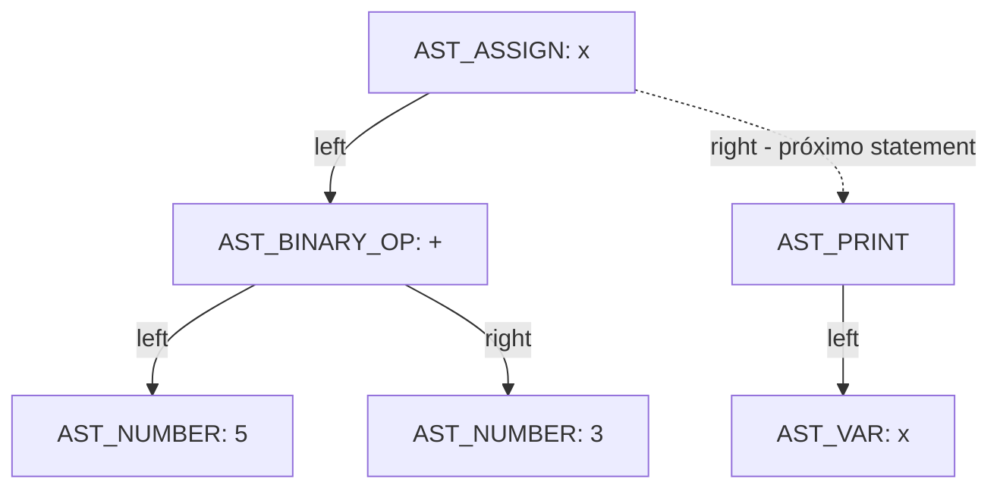

### Etapa 1: 

## 1. Como o caminho do arquivo-fonte é recebido?

O arquivo fonte está sendo recebido através das linhas de comando (argc/ argv). O caminho é o segundo argumento passado ao executar o programa, acessado como "argv[1]". EX: ./mini-c.exe examples/test.txt.

## 2. O que acontece quando nenhum arquivo é informado?

O programa verifica if (argc < 2). Se verdadeiro (ou seja, nenhum argumento além do nome do executável foi passado), ele imprime uma mensagem de erro em stderr explicando como usar o programa corretamente e encerra a execução retornando EXIT_FAILURE, sem tentar processar nada.
## 3. Qual função lê o arquivo?

A função que lê o arquivo vem da linha:  char* source_code = read_file(argv[1]);. Que retorna o conteúdo do arquivo-fonte como uma string char.
## 4. Qual função realiza a análise léxica?

A função que está responsável pela análise léxica é: TokenList tokens = lex(source_code);. Ela recebe o código-fonte já lido e e retorna uma lista de tokens. Depois imprime os tokens.
## 5. Qual função constrói a AST?

Linha do código que representa a questão - ASTNode* ast = parse(&tokens);. O parse tokens recebe a lista de tokens e o ASTNODE* representa a raiz da árvore sintática abstrata.

## 6. Qual função executa a AST?

A função - interpret(ast); . Ela percorre a árvore a partir da raiz e executa cada instrução.
## 7. Em que ordem essas funções são chamadas?

As etapas seguem a seguinte ordem: read_file → lex → parse → interpret.

## 8. Trecho da Main e explicação: 

int main(int argc, char* argv[]) {
    if (argc < 2) {
        fprintf(stderr, "Error: No source file specified.\n");
        return EXIT_FAILURE;
    }

    char* source_code = read_file(argv[1]);

    TokenList tokens = lex(source_code);

    ASTNode* ast = parse(&tokens);
    
    interpret(ast);

    free(source_code);

    return 0;
}

Nesse trecho da função main, primeiro está garantindo que o usuário passou o arquivo para rodar o programa e caso não tenha feito, já retorna com erro. Depois ele segue 4 etapas: Lê o texto bruto do arquivo, transforma o texto em tokens, organiza esses tokens em uma árvore que representa a estrutura do programa e no final percorre essa árvore executando cada instrução.

### Etapa 2: 

## Explique:

## - Por que é necessário reservar memória;

O programa não sabe de cara quanto de memória vai ser preciso para ler o arquivo, assim ele cria uma variável para saber o tamanho do arquivo e após isso aloca memória com o malloc (reservando 1 tamanho a mais para colocar o /0 no final depois).
## - Qual é o papel do caractere \0;

O /0 que foi colocado no final serve para mostrar para o programa onde termina a string.
## - O que acontece quando o arquivo não existe;

Caso não exista nenhum arquivo ou o programa não consigar abrir esse arquivo, ele vai retornar um aviso dizendo que não foi possível abrir o arquivo. Após isso, já encerra o programa automaticamente
## - Quem é responsável por liberar a memória reservada.

No código específico não existe nenhum comando para liberar a memória que foi reservada, pois o conteúdo ainda vai ser utilizado na main.

### Etapa 3: 

## 8.2 — Teste léxico obrigatório

### Teste válido — `testes/01_lexico_valido.txt`

Conteúdo do arquivo:
```
let valor1 = 123 + 4;
print(valor1);
```

Saída do programa:
```
Source code:
let valor1 = 123 + 4;
print(valor1);
Tokens:
LET
IDENT(valor1)
EQUAL
NUMBER(123)
PLUS
NUMBER(4)
SEMICOLON
PRINT
IDENT(valor1)
SEMICOLON
EOF
AST:
AST_ASSIGN(valor1)
  AST_BINARY_OP(+)
    AST_NUMBER(123)
    AST_NUMBER(4)
Program output:
127
```

### Teste inválido — `testes/02_lexico_invalido.txt`

Conteúdo do arquivo:
```
let valor = 10 @ 2;
```

Saída do programa:
```
Source code:
let valor = 10 @ 2;
Unknown character: @
```

- **Mensagem produzida:** `Unknown character: @`
- **Caractere que causou o erro:** `@`
- **Arquivo e função responsáveis pela detecção:** `src/lexer.c`, função `lex()`
- **Classificação do erro:** erro léxico — ocorre durante a tokenização, antes do parser e do interpretador entrarem em ação

## 8.3 — Perguntas obrigatórias

**1. Como o lexer diferencia `let` de um identificador comum?**

Ele não diferencia durante a leitura caractere a caractere — o processo é idêntico para qualquer palavra (`isalpha` no primeiro caractere, depois `isalnum` nos seguintes, acumulando tudo em `buffer`). A diferenciação só acontece depois, quando a palavra completa é comparada com `strcmp(buffer, "let")`. Se bater, gera `T_LET`; se bater com `"print"`, gera `T_PRINT`; caso contrário, é tratado como `T_IDENTIFIER` e o nome é copiado para o token.

**2. Como um número com vários dígitos é construído?**

Por acumulação dígito a dígito no loop `while (isdigit(source[i]))`: a cada iteração, `value = value * 10 + (source[i] - '0')`. Por exemplo, para "123": primeiro `value=1`, depois `value=12`, depois `value=123`.

**3. Identificadores como `nota1` são aceitos?**

Sim. O primeiro caractere precisa ser letra (`isalpha`), mas os caracteres seguintes só precisam ser `isalnum` (letra OU dígito). Como "nota1" começa com a letra `n`, o `1` no final é aceito normalmente como parte do mesmo identificador.

**4. Identificadores iniciados por número são aceitos?**

Não como um identificador único. O código verifica `isdigit(c)` antes de `isalpha(c)`, então se o primeiro caractere for um dígito, o lexer entra no ramo de números e lê só os dígitos consecutivos. Um caso como `1abc` geraria dois tokens separados — `NUMBER(1)` seguido de `IDENT(abc)` — e não um identificador `1abc`.

**5. O lexer registra linha e coluna?**

Não. A struct `Token` (em `lexer.h`) só tem os campos `type`, `value` e `name[32]` — não existe nenhum campo de linha ou coluna. Por isso a mensagem de erro do caractere desconhecido mostra apenas o caractere (`Unknown character: @`), sem indicar em que linha/posição do arquivo ele ocorreu.

**6. Existe limite para a quantidade de tokens?**

Sim. Logo no início de `lex()`, a lista é alocada com `malloc(128 * sizeof(Token))` — ou seja, espaço fixo para 128 tokens. O comentário ao lado diz "initial size, can grow", mas não existe nenhuma chamada a `realloc` em nenhum ponto da função — na prática, a lista nunca cresce.

**7. O que pode ocorrer se o programa gerar mais de 128 tokens?**

Um estouro de buffer (buffer overflow): a linha `list.tokens[list.count++] = ...` escreveria além do espaço alocado, corrompendo memória adjacente no heap. Isso é comportamento indefinido em C — pode causar desde um crash até corrupção silenciosa de dados, sem que o programa emita qualquer aviso ou erro tratado.

### Etapa 4:

## 9.1 — Formas reconhecidas

O parser confirma as formas do enunciado. A função `parse_statement()` trata `T_LET` (declaração: espera um IDENTIFICADOR, depois `=`, depois uma expressão via `parse_expression()`, depois `;`) e `T_PRINT` (espera uma expressão e depois `;`). Já `parse_expression()` trata números (`T_NUMBER`), identificadores (`T_IDENTIFIER`), expressões entre parênteses (`T_LPAREN ... T_RPAREN`, de forma recursiva) e operadores binários `+ - * /` em um laço `while`. Todo nó da AST é criado pela função `create_node()`, que aloca um `ASTNode` e preenche tipo, valor, nome e ponteiros para filho esquerdo/direito.

Uma observação importante: no `print`, o código não verifica explicitamente `(` e `)` — ele apenas chama `parse_expression()`, que trata o `(` como parte da regra genérica de expressão entre parênteses. Ou seja, na prática, tanto `print(x);` quanto `print x;` são aceitos pelo parser, já que o parêntese não é obrigatoriamente exigido pela regra de `print` em si.

## 9.2 — Testes sintáticos obrigatórios

### Teste válido — `testes/03_sintatico_valido.txt`

Conteúdo do arquivo:
```
let resultado = (10 + 5) * 2;
print(resultado);
```

Saída do programa:
```
Source code:
let resultado = (10 + 5) * 2;
print(resultado);
Tokens:
LET
IDENT(resultado)
EQUAL
NUMBER(10)
PLUS
NUMBER(5)
MULT
NUMBER(2)
SEMICOLON
PRINT
IDENT(resultado)
SEMICOLON
EOF
AST:
AST_ASSIGN(resultado)
  AST_BINARY_OP(*)
    AST_BINARY_OP(+)
      AST_NUMBER(10)
      AST_NUMBER(5)
    AST_NUMBER(2)
Program output:
30
```

- **Resultado esperado:** parsing bem-sucedido, respeitando a precedência imposta pelos parênteses — `(10 + 5) * 2 = 30`.
- **Resultado observado:** exatamente isso. AST corretamente estruturada e saída `30`. Código de saída: `0`.
- **Mensagem apresentada:** nenhuma (execução sem erros).
- **Posição informada pelo parser:** não aplicável (sem erro).
- **Função responsável:** `parse_statement()` e `parse_expression()`, em `src/parser.c`, processaram a entrada sem disparar nenhuma checagem de erro.

### Teste sem `=` — `testes/04_sem_igual.txt`

Conteúdo do arquivo:
```
let resultado 10 + 5;
```

Saída do programa:
```
Source code:
let resultado 10 + 5;
Tokens:
LET
IDENT(resultado)
NUMBER(10)
PLUS
NUMBER(5)
SEMICOLON
EOF
Syntax error: expected '=' at pos=2
```

- **Resultado esperado:** erro sintático, já que falta o `=` entre o identificador e a expressão.
- **Resultado observado:** o programa encerra com código de saída `1`, sem montar a AST.
- **Mensagem apresentada:** `Syntax error: expected '=' at pos=2`
- **Posição informada pelo parser:** `pos=2`, correspondente ao token `NUMBER(10)` (índice 0=`LET`, 1=`IDENT(resultado)`, 2=`NUMBER(10)`) — o parser esperava `=` nessa posição e encontrou um número.
- **Função responsável:** `parse_statement()`, em `src/parser.c`, no bloco `if (current.type == T_LET)`, na checagem `if (tokens->tokens[*pos].type != T_EQUAL)`.

### Teste sem `;` — `testes/05_sem_ponto_virgula.txt`

Conteúdo do arquivo:
```
let resultado = 10 + 5
```

Saída do programa:
```
Source code:
let resultado = 10 + 5
Tokens:
LET
IDENT(resultado)
EQUAL
NUMBER(10)
PLUS
NUMBER(5)
EOF
Syntax error: expected ';' at pos=6
```

- **Resultado esperado:** erro sintático por falta do `;` ao final da instrução.
- **Resultado observado:** o programa encerra com código de saída `1` logo após montar a expressão `10 + 5`.
- **Mensagem apresentada:** `Syntax error: expected ';' at pos=6`
- **Posição informada pelo parser:** `pos=6`, correspondente ao token `EOF` (índice 0=`LET`, 1=`IDENT`, 2=`EQUAL`, 3=`NUMBER(10)`, 4=`PLUS`, 5=`NUMBER(5)`, 6=`EOF`) — o parser consumiu toda a expressão e chegou ao fim da lista de tokens sem encontrar o `;` esperado.
- **Função responsável:** `parse_statement()`, em `src/parser.c`, no bloco `if (current.type == T_LET)`, na checagem `if (tokens->tokens[*pos].type != T_SEMICOLON)` logo após `parse_expression()`.

### Teste com parêntese incompleto — `testes/06_parentese_incompleto.txt`

Conteúdo do arquivo:
```
print((10 + 5);
```

Saída do programa:
```
Source code:
print((10 + 5);
Tokens:
PRINT
NUMBER(10)
PLUS
NUMBER(5)
SEMICOLON
EOF
Syntax error: expected ')' at pos=7
```

- **Resultado esperado:** erro sintático, pois há dois `(` abertos mas apenas um `)` fechando.
- **Resultado observado:** o programa encerra com código de saída `1`. Vale notar que a lista de tokens impressa não mostra os parênteses — isso é um detalhe à parte: a função `print_tokens()` em `lexer.c` não tem `case` para `T_LPAREN`/`T_RPAREN` no seu `switch`, então eles são tokenizados corretamente (o parser os usa normalmente), só não aparecem na listagem de depuração.
- **Mensagem apresentada:** `Syntax error: expected ')' at pos=7`
- **Posição informada pelo parser:** `pos=7`, correspondente ao token `SEMICOLON` (índice 0=`PRINT`, 1=`LPAREN`, 2=`LPAREN`, 3=`NUMBER(10)`, 4=`PLUS`, 5=`NUMBER(5)`, 6=`RPAREN`, 7=`SEMICOLON`) — o único `)` presente fechou o `(` mais interno, e o parser esperava um segundo `)` para fechar o primeiro `(`, mas encontrou `;` no lugar.
- **Função responsável:** `parse_expression()`, em `src/parser.c`, no bloco `else if (current.type == T_LPAREN)`, na checagem `if (tokens->tokens[*pos].type != T_RPAREN)`.

### Etapa 5: 

## 10.1 — Atividade obrigatória

Código usado:
```
let x = 5 + 3;
print(x);
```

AST impressa pelo programa:
```
AST_ASSIGN(x)
  AST_BINARY_OP(+)
    AST_NUMBER(5)
    AST_NUMBER(3)
```

Saída completa do programa (para referência):
```
Source code:
let x = 5 + 3;
print(x);
Tokens:
LET
IDENT(x)
EQUAL
NUMBER(5)
PLUS
NUMBER(3)
SEMICOLON
PRINT
IDENT(x)
SEMICOLON
EOF
AST:
AST_ASSIGN(x)
  AST_BINARY_OP(+)
    AST_NUMBER(5)
    AST_NUMBER(3)
Program output:
8
```

### Análise da árvore

**Qual nó representa a atribuição:** o nó raiz `AST_ASSIGN(x)`, do tipo `AST_ASSIGN` na enum `ASTNodeType`. Ele é criado em `parse_statement()` (`src/parser.c`) quando o parser reconhece o padrão `let IDENTIFICADOR = EXPRESSAO ;`.

**Onde o nome `x` é armazenado:** no campo `char name[32]` da própria struct `ASTNode`. Em `parser.c`, isso acontece na chamada `create_node(AST_ASSIGN, 0, var.name, expr, NULL)`, onde `var.name` é o nome capturado do token `T_IDENTIFIER` logo após o `let`.

**Quais nós representam os números:** os dois nós-folha `AST_NUMBER(5)` e `AST_NUMBER(3)`, do tipo `AST_NUMBER`. Cada um guarda seu valor no campo `int value` da struct (o campo `name` fica vazio, já que não se aplica a números).

**Qual nó representa a soma:** o nó `AST_BINARY_OP(+)`, do tipo `AST_BINARY_OP`. O caractere do operador (`+`) fica armazenado no campo `int value` (o `char` é implicitamente convertido para `int` ao ser salvo).

**Como os ponteiros `left` e `right` são utilizados:** o uso muda de acordo com o tipo do nó. Em `AST_BINARY_OP`, `left` aponta para o operando esquerdo (`AST_NUMBER(5)`) e `right` para o operando direito (`AST_NUMBER(3)`) — os dois são realmente filhos da operação. Já em `AST_ASSIGN`, apenas `left` é usado, apontando para a subexpressão atribuída (o `AST_BINARY_OP(+)`); o campo `right` nesse nó não representa um filho da atribuição, e sim o **próximo statement do programa** — é assim que `parse()` encadeia múltiplas instruções numa lista ligada (`AST_ASSIGN(x).right` aponta para o nó `AST_PRINT` gerado por `print(x);`).

**Observação importante:** por isso, a AST impressa acima mostra só o `AST_ASSIGN(x)` e sua subárvore — o `print(x);` existe na memória (e é executado corretamente pelo interpretador, daí a saída `8`), mas a função `print_ast()` não segue o ponteiro `right` do nó `AST_ASSIGN` para imprimi-lo. Ela só percorre `right` dentro do caso `AST_BINARY_OP` (para o operando direito), não no caso `AST_ASSIGN` (statement seguinte). Ou seja, `print_ast()` tem uma limitação: ela imprime corretamente a árvore de expressão de cada statement individual, mas não visualiza a cadeia de statements do programa inteiro.

### Representação em Mermaid



Diagrama alternativo, mostrando também a ligação (via `right`) com o próximo statement do programa — o `print(x);`, que não aparece na saída de `print_ast()`:



### Etapa 6:

## 11.1 — O que foi explicado

**`interpret(ASTNode* root)`** é o ponto de entrada do interpretador. Ele inicializa a tabela de símbolos com `init_symbol_table()` e percorre a lista de statements da AST através de um laço `while (current != NULL)`, chamando `exec_statement()` para cada nó e avançando com `current = current->right`. É esse `right` que encadeia `let idade = 30;` com o `print(idade);` seguinte — como vimos na Etapa 5, não é um filho de expressão, é o "próximo comando".

**`exec_statement(ASTNode* node, SymbolTable* table)`** decide o que fazer de acordo com o tipo do nó: se for `AST_ASSIGN`, avalia a expressão à direita do `=` com `eval_expression()` e guarda o resultado na tabela com `set_symbol()`; se for `AST_PRINT`, avalia a expressão e imprime o valor com `printf("%d\n", value)`. Statements soltos (`AST_NUMBER`, `AST_VAR`, `AST_BINARY_OP` sem atribuição nem print) também são aceitos — são avaliados, mas o resultado é descartado.

**`eval_expression(ASTNode* node, SymbolTable* table)`** calcula o valor de qualquer nó de expressão, de forma recursiva. Números (`AST_NUMBER`) retornam seu próprio valor; variáveis (`AST_VAR`) chamam `lookup_symbol()` pra buscar o valor atual na tabela; operações binárias (`AST_BINARY_OP`) avaliam recursivamente `node->left` e `node->right` primeiro, e só depois aplicam o operador (`+ - * /`) sobre os dois resultados — inclusive com a checagem de divisão por zero.

**`set_symbol(SymbolTable* table, const char* name, int value)`** insere ou atualiza uma variável: percorre a tabela procurando um símbolo com o mesmo nome; se achar, atualiza o valor; se não achar, adiciona uma entrada nova na próxima posição livre (`table->count`) — mas só se `table->count < 128`, senão gera `"Runtime error: symbol table overflow"` e encerra.

**`lookup_symbol(SymbolTable* table, const char* name)`** consulta o valor de uma variável: percorre a tabela procurando o nome; se achar, retorna o valor; se não achar, imprime `"Runtime error: undefined variable '%s'"` e encerra o programa com `exit(1)`.

**A tabela tem capacidade fixa para 128 símbolos:** a struct `SymbolTable` (em `interpreter.h`) tem `Symbol symbols[128]` — um array de tamanho fixo, sem realloc. É uma limitação parecida com a dos 128 tokens do lexer, mas aqui, diferente do lexer, existe uma checagem explícita (`if (table->count < 128)`) antes de escrever — ou seja, o overflow é tratado com uma mensagem de erro controlada, e não um estouro de buffer silencioso como acontecia em `lex()`.

## 11.2 — Testes obrigatórios

### Variável definida — `testes/08_variavel_definida.txt`

Conteúdo:
```
let idade = 30;
print(idade);
```

Saída:
```
Source code:
let idade = 30;
print(idade);
Tokens:
LET
IDENT(idade)
EQUAL
NUMBER(30)
SEMICOLON
PRINT
IDENT(idade)
SEMICOLON
EOF
AST:
AST_ASSIGN(idade)
  AST_NUMBER(30)
Program output:
30
```

- **Classificação:** não é erro — caso de controle, confirma que declaração e uso de variável funcionam corretamente. Código de saída: `0`.

### Variável não definida — `testes/09_variavel_indefinida.txt`

Conteúdo:
```
print(idade);
```

Saída:
```
Source code:
print(idade);
Tokens:
PRINT
IDENT(idade)
SEMICOLON
EOF
AST:
AST_PRINT
  AST_VAR(idade)
Program output:
Runtime error: undefined variable 'idade'
```

- **Classificação:** erro semântico detectado durante a execução. O código é léxica e sintaticamente válido — `print(idade);` bate perfeitamente com a gramática (`print ( EXPRESSAO ) ;`, onde `EXPRESSAO` pode ser um identificador) — por isso o lexer e o parser não acusam nada, e a AST é montada normalmente com `AST_VAR(idade)`. O erro só aparece quando o interpretador tenta *avaliar* essa variável, em `eval_expression()`, e chama `lookup_symbol()`, que não encontra "idade" na tabela (porque nenhum `let idade = ...` foi executado antes). Código de saída: `1`.

### Divisão por zero — `testes/10_divisao_zero.txt`

Conteúdo:
```
let resultado = 10 / 0;
print(resultado);
```

Saída:
```
Source code:
let resultado = 10 / 0;
print(resultado);
Tokens:
LET
IDENT(resultado)
EQUAL
NUMBER(10)
DIV
NUMBER(0)
SEMICOLON
PRINT
IDENT(resultado)
SEMICOLON
EOF
AST:
AST_ASSIGN(resultado)
  AST_BINARY_OP(/)
    AST_NUMBER(10)
    AST_NUMBER(0)
Program output:
Runtime error: division by zero
```

- **Classificação:** outro erro de execução (erro aritmético em tempo de execução). Diferente da variável indefinida, aqui não há violação de nenhuma regra de "significado" do programa (a variável existe, os tipos batem, a expressão é bem formada) — o problema é puramente numérico e só existe por causa dos valores específicos usados (`10 / 0`). A checagem acontece dentro de `eval_expression()`, no `case '/'`, com `if (right_val == 0)`, antes de fazer a divisão de fato. Código de saída: `1`.

### Por que a variável indefinida só é detectada pelo interpretador, e não pelo parser

O parser (`parse_expression()`, em `parser.c`) só verifica **estrutura**: quando ele encontra um token `T_IDENTIFIER`, ele aceita imediatamente e cria um nó `AST_VAR` com aquele nome — sem checar em nenhum lugar se essa variável já foi declarada antes. O parser não tem acesso a nenhuma tabela de símbolos; ele nem sabe que esse conceito existe. Do ponto de vista da gramática, `print(idade);` é 100% válido, com ou sem um `let idade = ...;` anterior.

A tabela de símbolos só existe dentro do interpretador (`SymbolTable`, em `interpreter.c`), e ela só é populada em tempo de execução, conforme cada `AST_ASSIGN` é processado por `exec_statement()`. Ou seja, "a variável existe" não é uma propriedade da sintaxe do programa — é uma propriedade do **estado de execução** em um determinado momento. Por isso essa checagem só pode acontecer depois que o parsing termina e a AST já está pronta: é o interpretador, ao percorrer a árvore e tentar avaliar `AST_VAR(idade)` com `eval_expression()`, que consulta `lookup_symbol()` e só então descobre que aquele nome nunca foi definido. Isso é exatamente a diferença entre análise sintática (estrutura das frases) e análise semântica (significado/validade em contexto) — e aqui essa análise semântica é feita de forma bem simples, sem uma fase separada, misturada diretamente com a própria interpretação/execução.