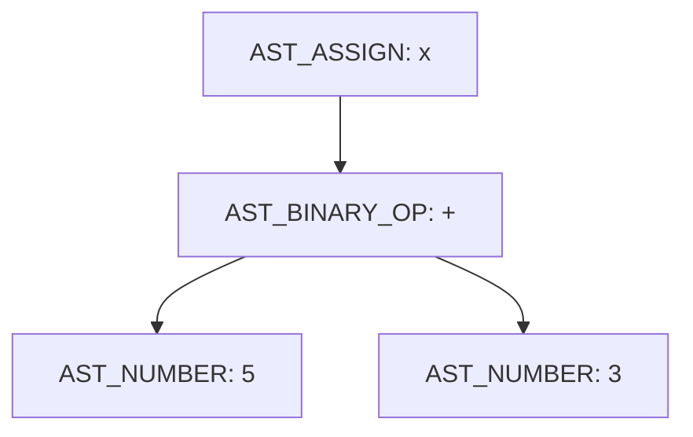
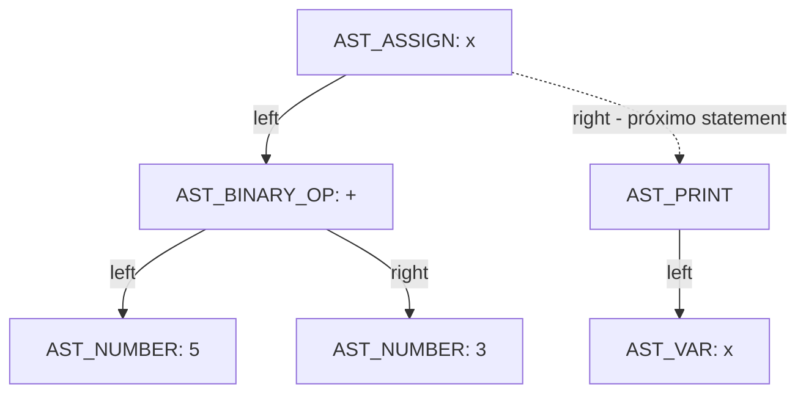

# Relatório — Análise Individual do Mini C Compiler

## Identificação do estudante

- **Nome:** Pedro Pereira Dutra
- **Turma/Instituição:** [IDP]
- **Disciplina:** Compiladores

## Identificação do projeto original

- **Nome do projeto:** Mini C Compiler
- **Autor original:** Rino Di Paola (usuário GitHub: `ironrinox`)
- **Repositório original:** https://github.com/ironrinox/mini-c-compiler
- **Licença:** MIT License (Copyright (c) 2025 Rino Di Paola), preservada neste repositório no arquivo `LICENSE`
- **Repositório individual (este trabalho):** https://github.com/dutrapedro06/Compiladores, código dentro de `atividade 1/mini-c-compiler/`

## Objetivo da atividade

Analisar tecnicamente o funcionamento interno do projeto Mini C Compiler — desde a leitura do arquivo-fonte até a interpretação da AST — documentando cada etapa do pipeline (leitura de arquivo, análise léxica, análise sintática, construção da AST, tabela de símbolos e interpretação), validando o comportamento observado com casos de teste próprios (válidos e inválidos), classificando corretamente a natureza do projeto (compilador, interpretador ou transpiler), identificando limitações reais do código através de testes práticos, e implementando e documentando uma melhoria individual sobre o projeto original.

## Preparação do ambiente

- **Sistema operacional:** Windows com WSL/Ubuntu
- **Compilador:** GCC (GNU Compiler Collection), padrão do sistema
- **Editor:** Visual Studio Code
- **Controle de versão:** Git, repositório hospedado no GitHub (`dutrapedro06/Compiladores`)
- Nenhuma dependência externa é necessária — o projeto é escrito em C puro (padrão da biblioteca C: `stdio.h`, `stdlib.h`, `string.h`, `ctype.h`), sem bibliotecas de terceiros.

## Procedimento de compilação e execução

Compilação (executado a partir da pasta `atividade 1/mini-c-compiler/`):
```bash
gcc src/main.c src/lexer.c src/parser.c src/interpreter.c src/utils.c -Iinclude -o mini-c.exe
```

Execução, passando um arquivo-fonte como argumento:
```bash
./mini-c.exe testes/NOME_DO_TESTE.txt
```

Todos os casos de teste usados neste relatório estão na pasta `testes/`, e as saídas reais de execução de cada um estão na pasta `evidencias/` (arquivos `T01.txt` a `T10.txt`).

## Arquitetura e responsabilidades dos arquivos

| Arquivo | Responsabilidade |
|---|---|
| `src/main.c` | Ponto de entrada do programa; orquestra o pipeline: leitura do arquivo → análise léxica → análise sintática → interpretação |
| `src/utils.c` / `include/utils.h` | Leitura do arquivo-fonte para memória (`read_file`) |
| `src/lexer.c` / `include/lexer.h` | Análise léxica: transforma o código-fonte em tokens (`lex`, `print_tokens`) |
| `src/parser.c` / `include/parser.h` | Análise sintática: transforma os tokens em AST (`parse`, `parse_statement`, `parse_expression`, `parse_term`, `parse_factor`, `print_ast`) |
| `src/interpreter.c` / `include/interpreter.h` | Tabela de símbolos e interpretação: percorre a AST e executa o programa (`interpret`, `exec_statement`, `eval_expression`) |
| `testes/` | Casos de teste (entradas `.txt`) usados na validação de cada etapa |
| `evidencias/` | Saídas reais de execução de cada teste obrigatório (T01–T10) |
| `examples/` | Exemplo original herdado do repositório de origem |

## Uso de ferramentas de IA

Este trabalho foi desenvolvido com o auxílio de uma ferramenta de IA (Claude, da Anthropic), com uso autorizado pelo professor. A IA foi usada para: ler e explicar o código-fonte do projeto original; orientar a criação e execução dos casos de teste; auxiliar na identificação e documentação da limitação de precedência/associatividade (Etapa 8); e auxiliar na implementação da correção dessa limitação (Etapa 9, `parse_expression`/`parse_term`/`parse_factor`). Todas as saídas foram executadas e conferidas manualmente pelo estudante (evidências em `evidencias/` e ao longo deste relatório), o código-fonte final foi revisado linha a linha antes de ser incorporado ao repositório, e o estudante é capaz de explicar tecnicamente cada trecho de código, decisão de implementação e resultado apresentado neste relatório e durante a defesa oral.

### Etapa 1: 

## 1. Como o caminho do arquivo-fonte é recebido?

O arquivo fonte está sendo recebido através das linhas de comando (argc/ argv). O caminho é o segundo argumento passado ao executar o programa, acessado como "argv[1]". EX: ./mini-c.exe examples/test.txt.

## 2. O que acontece quando nenhum arquivo é informado?

O programa verifica if (argc < 2). Se verdadeiro (ou seja, nenhum argumento além do nome do executável foi passado), ele imprime uma mensagem de erro em stderr explicando como usar o programa corretamente e encerra a execução retornando EXIT_FAILURE, sem tentar processar nada.
## 3. Qual função lê o arquivo?

A função que lê o arquivo vem da linha:  char* source_code = read_file(argv[1]);. Que retorna o conteúdo do arquivo-fonte como uma string char.
## 4. Qual função realiza a análise léxica?

A função que está responsável pela análise léxica é: TokenList tokens = lex(source_code);. Ela recebe o código-fonte já lido e e retorna uma lista de tokens. Depois imprime os tokens.
## 5. Qual função constrói a AST?

Linha do código que representa a questão - ASTNode* ast = parse(&tokens);. O parse tokens recebe a lista de tokens e o ASTNODE* representa a raiz da árvore sintática abstrata.

## 6. Qual função executa a AST?

A função - interpret(ast); . Ela percorre a árvore a partir da raiz e executa cada instrução.
## 7. Em que ordem essas funções são chamadas?

As etapas seguem a seguinte ordem: read_file → lex → parse → interpret.

## 8. Trecho da Main e explicação: 

int main(int argc, char* argv[]) {
    if (argc < 2) {
        fprintf(stderr, "Error: No source file specified.\n");
        return EXIT_FAILURE;
    }

    char* source_code = read_file(argv[1]);

    TokenList tokens = lex(source_code);

    ASTNode* ast = parse(&tokens);
    
    interpret(ast);

    free(source_code);

    return 0;
}

Nesse trecho da função main, primeiro está garantindo que o usuário passou o arquivo para rodar o programa e caso não tenha feito, já retorna com erro. Depois ele segue 4 etapas: Lê o texto bruto do arquivo, transforma o texto em tokens, organiza esses tokens em uma árvore que representa a estrutura do programa e no final percorre essa árvore executando cada instrução.

### Etapa 2: 

## Explique:

## - Por que é necessário reservar memória;

O programa não sabe de cara quanto de memória vai ser preciso para ler o arquivo, assim ele cria uma variável para saber o tamanho do arquivo e após isso aloca memória com o malloc (reservando 1 tamanho a mais para colocar o /0 no final depois).
## - Qual é o papel do caractere \0;

O /0 que foi colocado no final serve para mostrar para o programa onde termina a string.
## - O que acontece quando o arquivo não existe;

Caso não exista nenhum arquivo ou o programa não consigar abrir esse arquivo, ele vai retornar um aviso dizendo que não foi possível abrir o arquivo. Após isso, já encerra o programa automaticamente
## - Quem é responsável por liberar a memória reservada.

No código específico não existe nenhum comando para liberar a memória que foi reservada, pois o conteúdo ainda vai ser utilizado na main.

### Etapa 3: 

## 8.2 — Teste léxico obrigatório

### Teste válido — `testes/01_lexico_valido.txt`

Conteúdo do arquivo:
```
let valor1 = 123 + 4;
print(valor1);
```

Saída do programa:
```
Source code:
let valor1 = 123 + 4;
print(valor1);
Tokens:
LET
IDENT(valor1)
EQUAL
NUMBER(123)
PLUS
NUMBER(4)
SEMICOLON
PRINT
IDENT(valor1)
SEMICOLON
EOF
AST:
AST_ASSIGN(valor1)
  AST_BINARY_OP(+)
    AST_NUMBER(123)
    AST_NUMBER(4)
Program output:
127
```

### Teste inválido — `testes/02_lexico_invalido.txt`

Conteúdo do arquivo:
```
let valor = 10 @ 2;
```

Saída do programa:
```
Source code:
let valor = 10 @ 2;
Unknown character: @
```

- **Mensagem produzida:** `Unknown character: @`
- **Caractere que causou o erro:** `@`
- **Arquivo e função responsáveis pela detecção:** `src/lexer.c`, função `lex()`
- **Classificação do erro:** erro léxico — ocorre durante a tokenização, antes do parser e do interpretador entrarem em ação

## 8.3 — Perguntas obrigatórias

**1. Como o lexer diferencia `let` de um identificador comum?**

Ele não diferencia durante a leitura caractere a caractere — o processo é idêntico para qualquer palavra (`isalpha` no primeiro caractere, depois `isalnum` nos seguintes, acumulando tudo em `buffer`). A diferenciação só acontece depois, quando a palavra completa é comparada com `strcmp(buffer, "let")`. Se bater, gera `T_LET`; se bater com `"print"`, gera `T_PRINT`; caso contrário, é tratado como `T_IDENTIFIER` e o nome é copiado para o token.

**2. Como um número com vários dígitos é construído?**

Por acumulação dígito a dígito no loop `while (isdigit(source[i]))`: a cada iteração, `value = value * 10 + (source[i] - '0')`. Por exemplo, para "123": primeiro `value=1`, depois `value=12`, depois `value=123`.

**3. Identificadores como `nota1` são aceitos?**

Sim. O primeiro caractere precisa ser letra (`isalpha`), mas os caracteres seguintes só precisam ser `isalnum` (letra OU dígito). Como "nota1" começa com a letra `n`, o `1` no final é aceito normalmente como parte do mesmo identificador.

**4. Identificadores iniciados por número são aceitos?**

Não como um identificador único. O código verifica `isdigit(c)` antes de `isalpha(c)`, então se o primeiro caractere for um dígito, o lexer entra no ramo de números e lê só os dígitos consecutivos. Um caso como `1abc` geraria dois tokens separados — `NUMBER(1)` seguido de `IDENT(abc)` — e não um identificador `1abc`.

**5. O lexer registra linha e coluna?**

Não. A struct `Token` (em `lexer.h`) só tem os campos `type`, `value` e `name[32]` — não existe nenhum campo de linha ou coluna. Por isso a mensagem de erro do caractere desconhecido mostra apenas o caractere (`Unknown character: @`), sem indicar em que linha/posição do arquivo ele ocorreu.

**6. Existe limite para a quantidade de tokens?**

Sim. Logo no início de `lex()`, a lista é alocada com `malloc(128 * sizeof(Token))` — ou seja, espaço fixo para 128 tokens. O comentário ao lado diz "initial size, can grow", mas não existe nenhuma chamada a `realloc` em nenhum ponto da função — na prática, a lista nunca cresce.

**7. O que pode ocorrer se o programa gerar mais de 128 tokens?**

Um estouro de buffer (buffer overflow): a linha `list.tokens[list.count++] = ...` escreveria além do espaço alocado, corrompendo memória adjacente no heap. Isso é comportamento indefinido em C — pode causar desde um crash até corrupção silenciosa de dados, sem que o programa emita qualquer aviso ou erro tratado.

### Etapa 4:

## 9.1 — Formas reconhecidas

O parser confirma as formas do enunciado. A função `parse_statement()` trata `T_LET` (declaração: espera um IDENTIFICADOR, depois `=`, depois uma expressão via `parse_expression()`, depois `;`) e `T_PRINT` (espera uma expressão e depois `;`). Já `parse_expression()` trata números (`T_NUMBER`), identificadores (`T_IDENTIFIER`), expressões entre parênteses (`T_LPAREN ... T_RPAREN`, de forma recursiva) e operadores binários `+ - * /` em um laço `while`. Todo nó da AST é criado pela função `create_node()`, que aloca um `ASTNode` e preenche tipo, valor, nome e ponteiros para filho esquerdo/direito.

Uma observação importante: no `print`, o código não verifica explicitamente `(` e `)` — ele apenas chama `parse_expression()`, que trata o `(` como parte da regra genérica de expressão entre parênteses. Ou seja, na prática, tanto `print(x);` quanto `print x;` são aceitos pelo parser, já que o parêntese não é obrigatoriamente exigido pela regra de `print` em si.

## 9.2 — Testes sintáticos obrigatórios

### Teste válido — `testes/03_sintatico_valido.txt`

Conteúdo do arquivo:
```
let resultado = (10 + 5) * 2;
print(resultado);
```

Saída do programa:
```
Source code:
let resultado = (10 + 5) * 2;
print(resultado);
Tokens:
LET
IDENT(resultado)
EQUAL
NUMBER(10)
PLUS
NUMBER(5)
MULT
NUMBER(2)
SEMICOLON
PRINT
IDENT(resultado)
SEMICOLON
EOF
AST:
AST_ASSIGN(resultado)
  AST_BINARY_OP(*)
    AST_BINARY_OP(+)
      AST_NUMBER(10)
      AST_NUMBER(5)
    AST_NUMBER(2)
Program output:
30
```

- **Resultado esperado:** parsing bem-sucedido, respeitando a precedência imposta pelos parênteses — `(10 + 5) * 2 = 30`.
- **Resultado observado:** exatamente isso. AST corretamente estruturada e saída `30`. Código de saída: `0`.
- **Mensagem apresentada:** nenhuma (execução sem erros).
- **Posição informada pelo parser:** não aplicável (sem erro).
- **Função responsável:** `parse_statement()` e `parse_expression()`, em `src/parser.c`, processaram a entrada sem disparar nenhuma checagem de erro.

### Teste sem `=` — `testes/04_sem_igual.txt`

Conteúdo do arquivo:
```
let resultado 10 + 5;
```

Saída do programa:
```
Source code:
let resultado 10 + 5;
Tokens:
LET
IDENT(resultado)
NUMBER(10)
PLUS
NUMBER(5)
SEMICOLON
EOF
Syntax error: expected '=' at pos=2
```

- **Resultado esperado:** erro sintático, já que falta o `=` entre o identificador e a expressão.
- **Resultado observado:** o programa encerra com código de saída `1`, sem montar a AST.
- **Mensagem apresentada:** `Syntax error: expected '=' at pos=2`
- **Posição informada pelo parser:** `pos=2`, correspondente ao token `NUMBER(10)` (índice 0=`LET`, 1=`IDENT(resultado)`, 2=`NUMBER(10)`) — o parser esperava `=` nessa posição e encontrou um número.
- **Função responsável:** `parse_statement()`, em `src/parser.c`, no bloco `if (current.type == T_LET)`, na checagem `if (tokens->tokens[*pos].type != T_EQUAL)`.

### Teste sem `;` — `testes/05_sem_ponto_virgula.txt`

Conteúdo do arquivo:
```
let resultado = 10 + 5
```

Saída do programa:
```
Source code:
let resultado = 10 + 5
Tokens:
LET
IDENT(resultado)
EQUAL
NUMBER(10)
PLUS
NUMBER(5)
EOF
Syntax error: expected ';' at pos=6
```

- **Resultado esperado:** erro sintático por falta do `;` ao final da instrução.
- **Resultado observado:** o programa encerra com código de saída `1` logo após montar a expressão `10 + 5`.
- **Mensagem apresentada:** `Syntax error: expected ';' at pos=6`
- **Posição informada pelo parser:** `pos=6`, correspondente ao token `EOF` (índice 0=`LET`, 1=`IDENT`, 2=`EQUAL`, 3=`NUMBER(10)`, 4=`PLUS`, 5=`NUMBER(5)`, 6=`EOF`) — o parser consumiu toda a expressão e chegou ao fim da lista de tokens sem encontrar o `;` esperado.
- **Função responsável:** `parse_statement()`, em `src/parser.c`, no bloco `if (current.type == T_LET)`, na checagem `if (tokens->tokens[*pos].type != T_SEMICOLON)` logo após `parse_expression()`.

### Teste com parêntese incompleto — `testes/06_parentese_incompleto.txt`

Conteúdo do arquivo:
```
print((10 + 5);
```

Saída do programa:
```
Source code:
print((10 + 5);
Tokens:
PRINT
NUMBER(10)
PLUS
NUMBER(5)
SEMICOLON
EOF
Syntax error: expected ')' at pos=7
```

- **Resultado esperado:** erro sintático, pois há dois `(` abertos mas apenas um `)` fechando.
- **Resultado observado:** o programa encerra com código de saída `1`. Vale notar que a lista de tokens impressa não mostra os parênteses — isso é um detalhe à parte: a função `print_tokens()` em `lexer.c` não tem `case` para `T_LPAREN`/`T_RPAREN` no seu `switch`, então eles são tokenizados corretamente (o parser os usa normalmente), só não aparecem na listagem de depuração.
- **Mensagem apresentada:** `Syntax error: expected ')' at pos=7`
- **Posição informada pelo parser:** `pos=7`, correspondente ao token `SEMICOLON` (índice 0=`PRINT`, 1=`LPAREN`, 2=`LPAREN`, 3=`NUMBER(10)`, 4=`PLUS`, 5=`NUMBER(5)`, 6=`RPAREN`, 7=`SEMICOLON`) — o único `)` presente fechou o `(` mais interno, e o parser esperava um segundo `)` para fechar o primeiro `(`, mas encontrou `;` no lugar.
- **Função responsável:** `parse_expression()`, em `src/parser.c`, no bloco `else if (current.type == T_LPAREN)`, na checagem `if (tokens->tokens[*pos].type != T_RPAREN)`.

### Etapa 5: 

## 10.1 — Atividade obrigatória

Código usado:
```
let x = 5 + 3;
print(x);
```

AST impressa pelo programa:
```
AST_ASSIGN(x)
  AST_BINARY_OP(+)
    AST_NUMBER(5)
    AST_NUMBER(3)
```

Saída completa do programa (para referência):
```
Source code:
let x = 5 + 3;
print(x);
Tokens:
LET
IDENT(x)
EQUAL
NUMBER(5)
PLUS
NUMBER(3)
SEMICOLON
PRINT
IDENT(x)
SEMICOLON
EOF
AST:
AST_ASSIGN(x)
  AST_BINARY_OP(+)
    AST_NUMBER(5)
    AST_NUMBER(3)
Program output:
8
```

### Análise da árvore

**Qual nó representa a atribuição:** o nó raiz `AST_ASSIGN(x)`, do tipo `AST_ASSIGN` na enum `ASTNodeType`. Ele é criado em `parse_statement()` (`src/parser.c`) quando o parser reconhece o padrão `let IDENTIFICADOR = EXPRESSAO ;`.

**Onde o nome `x` é armazenado:** no campo `char name[32]` da própria struct `ASTNode`. Em `parser.c`, isso acontece na chamada `create_node(AST_ASSIGN, 0, var.name, expr, NULL)`, onde `var.name` é o nome capturado do token `T_IDENTIFIER` logo após o `let`.

**Quais nós representam os números:** os dois nós-folha `AST_NUMBER(5)` e `AST_NUMBER(3)`, do tipo `AST_NUMBER`. Cada um guarda seu valor no campo `int value` da struct (o campo `name` fica vazio, já que não se aplica a números).

**Qual nó representa a soma:** o nó `AST_BINARY_OP(+)`, do tipo `AST_BINARY_OP`. O caractere do operador (`+`) fica armazenado no campo `int value` (o `char` é implicitamente convertido para `int` ao ser salvo).

**Como os ponteiros `left` e `right` são utilizados:** o uso muda de acordo com o tipo do nó. Em `AST_BINARY_OP`, `left` aponta para o operando esquerdo (`AST_NUMBER(5)`) e `right` para o operando direito (`AST_NUMBER(3)`) — os dois são realmente filhos da operação. Já em `AST_ASSIGN`, apenas `left` é usado, apontando para a subexpressão atribuída (o `AST_BINARY_OP(+)`); o campo `right` nesse nó não representa um filho da atribuição, e sim o **próximo statement do programa** — é assim que `parse()` encadeia múltiplas instruções numa lista ligada (`AST_ASSIGN(x).right` aponta para o nó `AST_PRINT` gerado por `print(x);`).

**Observação importante:** por isso, a AST impressa acima mostra só o `AST_ASSIGN(x)` e sua subárvore — o `print(x);` existe na memória (e é executado corretamente pelo interpretador, daí a saída `8`), mas a função `print_ast()` não segue o ponteiro `right` do nó `AST_ASSIGN` para imprimi-lo. Ela só percorre `right` dentro do caso `AST_BINARY_OP` (para o operando direito), não no caso `AST_ASSIGN` (statement seguinte). Ou seja, `print_ast()` tem uma limitação: ela imprime corretamente a árvore de expressão de cada statement individual, mas não visualiza a cadeia de statements do programa inteiro.

### Representação em Mermaid



Diagrama alternativo, mostrando também a ligação (via `right`) com o próximo statement do programa — o `print(x);`, que não aparece na saída de `print_ast()`:



### Etapa 6:

## 11.1 — O que foi explicado

**`interpret(ASTNode* root)`** é o ponto de entrada do interpretador. Ele inicializa a tabela de símbolos com `init_symbol_table()` e percorre a lista de statements da AST através de um laço `while (current != NULL)`, chamando `exec_statement()` para cada nó e avançando com `current = current->right`. É esse `right` que encadeia `let idade = 30;` com o `print(idade);` seguinte — como vimos na Etapa 5, não é um filho de expressão, é o "próximo comando".

**`exec_statement(ASTNode* node, SymbolTable* table)`** decide o que fazer de acordo com o tipo do nó: se for `AST_ASSIGN`, avalia a expressão à direita do `=` com `eval_expression()` e guarda o resultado na tabela com `set_symbol()`; se for `AST_PRINT`, avalia a expressão e imprime o valor com `printf("%d\n", value)`. Statements soltos (`AST_NUMBER`, `AST_VAR`, `AST_BINARY_OP` sem atribuição nem print) também são aceitos — são avaliados, mas o resultado é descartado.

**`eval_expression(ASTNode* node, SymbolTable* table)`** calcula o valor de qualquer nó de expressão, de forma recursiva. Números (`AST_NUMBER`) retornam seu próprio valor; variáveis (`AST_VAR`) chamam `lookup_symbol()` pra buscar o valor atual na tabela; operações binárias (`AST_BINARY_OP`) avaliam recursivamente `node->left` e `node->right` primeiro, e só depois aplicam o operador (`+ - * /`) sobre os dois resultados — inclusive com a checagem de divisão por zero.

**`set_symbol(SymbolTable* table, const char* name, int value)`** insere ou atualiza uma variável: percorre a tabela procurando um símbolo com o mesmo nome; se achar, atualiza o valor; se não achar, adiciona uma entrada nova na próxima posição livre (`table->count`) — mas só se `table->count < 128`, senão gera `"Runtime error: symbol table overflow"` e encerra.

**`lookup_symbol(SymbolTable* table, const char* name)`** consulta o valor de uma variável: percorre a tabela procurando o nome; se achar, retorna o valor; se não achar, imprime `"Runtime error: undefined variable '%s'"` e encerra o programa com `exit(1)`.

**A tabela tem capacidade fixa para 128 símbolos:** a struct `SymbolTable` (em `interpreter.h`) tem `Symbol symbols[128]` — um array de tamanho fixo, sem realloc. É uma limitação parecida com a dos 128 tokens do lexer, mas aqui, diferente do lexer, existe uma checagem explícita (`if (table->count < 128)`) antes de escrever — ou seja, o overflow é tratado com uma mensagem de erro controlada, e não um estouro de buffer silencioso como acontecia em `lex()`.

## 11.2 — Testes obrigatórios

### Variável definida — `testes/08_variavel_definida.txt`

Conteúdo:
```
let idade = 30;
print(idade);
```

Saída:
```
Source code:
let idade = 30;
print(idade);
Tokens:
LET
IDENT(idade)
EQUAL
NUMBER(30)
SEMICOLON
PRINT
IDENT(idade)
SEMICOLON
EOF
AST:
AST_ASSIGN(idade)
  AST_NUMBER(30)
Program output:
30
```

- **Classificação:** não é erro — caso de controle, confirma que declaração e uso de variável funcionam corretamente. Código de saída: `0`.

### Variável não definida — `testes/09_variavel_indefinida.txt`

Conteúdo:
```
print(idade);
```

Saída:
```
Source code:
print(idade);
Tokens:
PRINT
IDENT(idade)
SEMICOLON
EOF
AST:
AST_PRINT
  AST_VAR(idade)
Program output:
Runtime error: undefined variable 'idade'
```

- **Classificação:** erro semântico detectado durante a execução. O código é léxica e sintaticamente válido — `print(idade);` bate perfeitamente com a gramática (`print ( EXPRESSAO ) ;`, onde `EXPRESSAO` pode ser um identificador) — por isso o lexer e o parser não acusam nada, e a AST é montada normalmente com `AST_VAR(idade)`. O erro só aparece quando o interpretador tenta *avaliar* essa variável, em `eval_expression()`, e chama `lookup_symbol()`, que não encontra "idade" na tabela (porque nenhum `let idade = ...` foi executado antes). Código de saída: `1`.

### Divisão por zero — `testes/10_divisao_zero.txt`

Conteúdo:
```
let resultado = 10 / 0;
print(resultado);
```

Saída:
```
Source code:
let resultado = 10 / 0;
print(resultado);
Tokens:
LET
IDENT(resultado)
EQUAL
NUMBER(10)
DIV
NUMBER(0)
SEMICOLON
PRINT
IDENT(resultado)
SEMICOLON
EOF
AST:
AST_ASSIGN(resultado)
  AST_BINARY_OP(/)
    AST_NUMBER(10)
    AST_NUMBER(0)
Program output:
Runtime error: division by zero
```

- **Classificação:** outro erro de execução (erro aritmético em tempo de execução). Diferente da variável indefinida, aqui não há violação de nenhuma regra de "significado" do programa (a variável existe, os tipos batem, a expressão é bem formada) — o problema é puramente numérico e só existe por causa dos valores específicos usados (`10 / 0`). A checagem acontece dentro de `eval_expression()`, no `case '/'`, com `if (right_val == 0)`, antes de fazer a divisão de fato. Código de saída: `1`.

### Por que a variável indefinida só é detectada pelo interpretador, e não pelo parser

O parser (`parse_expression()`, em `parser.c`) só verifica **estrutura**: quando ele encontra um token `T_IDENTIFIER`, ele aceita imediatamente e cria um nó `AST_VAR` com aquele nome — sem checar em nenhum lugar se essa variável já foi declarada antes. O parser não tem acesso a nenhuma tabela de símbolos; ele nem sabe que esse conceito existe. Do ponto de vista da gramática, `print(idade);` é 100% válido, com ou sem um `let idade = ...;` anterior.

A tabela de símbolos só existe dentro do interpretador (`SymbolTable`, em `interpreter.c`), e ela só é populada em tempo de execução, conforme cada `AST_ASSIGN` é processado por `exec_statement()`. Ou seja, "a variável existe" não é uma propriedade da sintaxe do programa — é uma propriedade do **estado de execução** em um determinado momento. Por isso essa checagem só pode acontecer depois que o parsing termina e a AST já está pronta: é o interpretador, ao percorrer a árvore e tentar avaliar `AST_VAR(idade)` com `eval_expression()`, que consulta `lookup_symbol()` e só então descobre que aquele nome nunca foi definido. Isso é exatamente a diferença entre análise sintática (estrutura das frases) e análise semântica (significado/validade em contexto) — e aqui essa análise semântica é feita de forma bem simples, sem uma fase separada, misturada diretamente com a própria interpretação/execução.

### Etapa 7:

## 12 — Compilador ou interpretador?

**Conclusão: o projeto é, atualmente, um interpretador — mais especificamente, um interpretador que percorre a árvore (*tree-walking interpreter*).** Não é um compilador nem um transpiler, no estado atual do código.

### Justificativa técnica

**O projeto não produz nenhum arquivo de saída.** Em `src/main.c`, a única chamada de `fopen` em todo o pipeline é dentro de `read_file()` (`src/utils.c`), e ela abre o arquivo em modo leitura (`"r"`) — para ler o código-fonte, não para escrever nada. Em nenhum lugar do código existe um `fopen(..., "w")`, `fwrite`, ou qualquer chamada que grave um arquivo `.exe`, `.o`, `.asm` ou similar. O único lugar onde o programa produz saída visível é via `printf`, direto no terminal (`stdout`) — o que é comportamento de execução, não de compilação.

**Não gera assembly.** Não há, em nenhum arquivo do projeto, nenhuma estrutura de dados ou função voltada a emitir instruções de uma arquitetura (x86, ARM, etc.) — nenhuma tabela de opcodes, nenhuma geração de mnemônicos.

**Não gera bytecode.** Também não existe nenhuma representação intermediária em formato de bytecode (como um array de instruções para uma máquina virtual) sendo produzida em nenhuma etapa do pipeline.

**Não gera código C (não é transpiler).** Um transpiler pegaria a AST e escreveria como saída um novo arquivo-fonte em outra linguagem (ou até na mesma linguagem, reescrito). Isso também não acontece aqui — não existe nenhuma função que serialize a AST de volta como texto de código-fonte para gravar em disco. (A função `print_ast()`, em `parser.c`, imprime a AST no console para fins de depuração, mas isso é só um dump legível da árvore — não é código executável gerado, e nem é salvo em arquivo.)

**O programa percorre a AST e calcula os resultados diretamente — essa é a evidência central de que é um interpretador.** Isso acontece explicitamente em `src/interpreter.c`:
- `interpret(ASTNode* root)` percorre a lista de statements da AST (`while (current != NULL) { exec_statement(...); current = current->right; }`).
- `exec_statement()` executa cada statement na hora — por exemplo, no caso `AST_PRINT`, ele já chama `printf("%d\n", value)` imediatamente, produzindo o efeito no mesmo momento em que aquele nó da árvore é visitado.
- `eval_expression()` calcula o valor de cada expressão recursivamente e devolve um `int` — a soma, subtração, etc. são computadas em tempo real, usando a CPU que está rodando o próprio `mini-c.exe`, e não geram nenhuma instrução para ser executada depois por outra máquina.

Ou seja: não existe uma fase de "tradução para outra representação, que depois é executada por outra coisa" (isso seria compilação/transpilação) — existe uma única fase, onde o código C do próprio interpretador (`eval_expression`, `exec_statement`) já produz o resultado final enquanto percorre a árvore.

Vale registrar também que essa conclusão bate com o que os próprios autores do projeto documentam: o comentário no topo de `main()` já anuncia a etapa 3 como `"Interpretation (execute the AST) - to be implemented later"`, e o `README.md` do repositório descreve o projeto como um trabalho em andamento ("work-in-progress interpreter"), citando explicitamente planos futuros para "code generation capabilities" — ou seja, os próprios criadores reconhecem que, hoje, é um interpretador, e que geração de código (o que caracterizaria um compilador) é algo ainda não implementado.

### Etapa 8:

## 13 — Investigação de precedência e associatividade

**Conclusão geral: o parser NÃO implementa precedência de operadores corretamente.** Ele não tem nenhuma tabela de precedência nem separação entre "nível de termo" (`*`, `/`) e "nível de expressão" (`+`, `-`), como um parser correto normalmente teria. Em `parse_expression()` (`src/parser.c`), todos os quatro operadores (`+ - * /`) são tratados dentro do mesmo laço `while`, sem distinção de prioridade. Além disso, o operando direito de cada operação é obtido chamando `parse_expression()` recursivamente de forma **completa** (`right = parse_expression(tokens, pos)`), não apenas o próximo número/variável — isso faz o parser **sempre agrupar para a direita**, seja qual for o operador. O resultado é: às vezes esse agrupamento à direita coincide com a precedência matemática correta (por acaso), e às vezes não — e nunca há associatividade à esquerda, nem para operadores como `-` e `/` que matematicamente exigem isso.

### Teste A — `print(2 * 3 + 4);`

Conteúdo:
```
print(2 * 3 + 4);
```

AST impressa:
```
AST_PRINT
  AST_BINARY_OP(*)
    AST_NUMBER(2)
    AST_BINARY_OP(+)
      AST_NUMBER(3)
      AST_NUMBER(4)
```

Saída completa:
```
Source code:
print(2 * 3 + 4);
Tokens:
PRINT
NUMBER(2)
MULT
NUMBER(3)
PLUS
NUMBER(4)
SEMICOLON
EOF
AST:
AST_PRINT
  AST_BINARY_OP(*)
    AST_NUMBER(2)
    AST_BINARY_OP(+)
      AST_NUMBER(3)
      AST_NUMBER(4)
Program output:
14
```

1. **Resultado obtido:** `14`
2. **AST impressa:** acima — repare que o `*` (que deveria ter prioridade maior) ficou como nó raiz, com o `+` inteiro como seu operando direito: `2 * (3 + 4)`.
3. **Comparação com o esperado:** o esperado pela aritmética convencional era `10` (`(2*3)+4`). O parser produziu `14` (`2*(3+4)`). **Resultado incorreto.**
4. **Ordem adotada pelo parser:** o parser lê `2`, encontra o operador `*`, e chama `parse_expression()` recursivamente para o que vem depois — essa chamada recursiva não para no próximo número, ela consome a expressão inteira que sobrou (`3 + 4`), formando `AST_BINARY_OP(+)` primeiro, e só depois esse resultado vira o filho direito do `*`. Ou seja, o parser simplesmente agrupa da esquerda pra direita "no sentido inverso" (o último operador encontrado na leitura acaba ficando mais interno na árvore, e o primeiro operador lido vira a raiz — mas com o restante inteiro como seu operando direito).
5. **Existe problema:** sim — **erro de precedência**. O `*` deveria "prender" só o `3`, e o `+ 4` deveria ser aplicado depois, sobre o resultado do `2*3`. Em vez disso, o `+` "rouba" o `3` e o `4` pra formar sua própria subexpressão antes do `*` conseguir se aplicar.

### Teste B — `print(10 - 3 - 2);`

Conteúdo:
```
print(10 - 3 - 2);
```

AST impressa:
```
AST_PRINT
  AST_BINARY_OP(-)
    AST_NUMBER(10)
    AST_BINARY_OP(-)
      AST_NUMBER(3)
      AST_NUMBER(2)
```

Saída completa:
```
Source code:
print(10 - 3 - 2);
Tokens:
PRINT
NUMBER(10)
MINUS
NUMBER(3)
MINUS
NUMBER(2)
SEMICOLON
EOF
AST:
AST_PRINT
  AST_BINARY_OP(-)
    AST_NUMBER(10)
    AST_BINARY_OP(-)
      AST_NUMBER(3)
      AST_NUMBER(2)
Program output:
9
```

1. **Resultado obtido:** `9`
2. **AST impressa:** acima — o segundo `-` ficou aninhado como filho direito do primeiro: `10 - (3 - 2)`.
3. **Comparação com o esperado:** o esperado pela associatividade convencional (operadores de mesmo nível se agrupam da esquerda pra direita) era `5` (`(10-3)-2`). O parser produziu `9` (`10-(3-2)`). **Resultado incorreto.**
4. **Ordem adotada pelo parser:** igual ao Teste A — ao encontrar o primeiro `-`, o parser chama `parse_expression()` recursivamente para tudo que sobra (`3 - 2`), que forma sua própria subtração antes de virar o operando direito do primeiro `-`. O parser é, na prática, **associativo à direita** para todos os operadores, quando o correto para `+ - * /` é serem associativos à **esquerda**.
5. **Existe problema:** sim — **erro de associatividade**. Para subtração e divisão, isso muda o resultado matematicamente (para `+` e `*`, associar à direita ou à esquerda dá o mesmo resultado numérico, já que são operações associativas; mas para `-` e `/`, não são, e por isso o erro aparece de forma bem visível aqui).

### Teste C — `print(2 + 3 * 4);`

Conteúdo:
```
print(2 + 3 * 4);
```

AST impressa:
```
AST_PRINT
  AST_BINARY_OP(+)
    AST_NUMBER(2)
    AST_BINARY_OP(*)
      AST_NUMBER(3)
      AST_NUMBER(4)
```

Saída completa:
```
Source code:
print(2 + 3 * 4);
Tokens:
PRINT
NUMBER(2)
PLUS
NUMBER(3)
MULT
NUMBER(4)
SEMICOLON
EOF
AST:
AST_PRINT
  AST_BINARY_OP(+)
    AST_NUMBER(2)
    AST_BINARY_OP(*)
      AST_NUMBER(3)
      AST_NUMBER(4)
Program output:
14
```

1. **Resultado obtido:** `14`
2. **AST impressa:** acima — o `*` ficou aninhado como filho direito do `+`: `2 + (3 * 4)`.
3. **Comparação com o esperado:** o esperado era `14` (`2 + (3*4)`). O parser produziu `14`. **Resultado bate com o esperado — mas por coincidência, não por precedência real** (ver explicação abaixo).
4. **Ordem adotada pelo parser:** o parser lê `2`, encontra `+`, chama `parse_expression()` recursivamente para o restante (`3 * 4`), que forma o `AST_BINARY_OP(*)` primeiro e vira o operando direito do `+`. Nesse caso específico, a mesma estratégia de "sempre agrupar à direita" que causou erro nos Testes A e B aqui produziu o agrupamento correto — porque, por coincidência, o operador de maior precedência (`*`) apareceu depois do de menor precedência (`+`) na leitura da esquerda pra direita.
5. **Existe problema:** não neste caso específico, mas **o motivo do resultado certo não é que o parser entende precedência** — é só que a ordem de leitura (menor precedência primeiro, maior precedência depois) coincidiu com o padrão de agrupamento à direita que o parser sempre aplica. Basta inverter a ordem (como no Teste A, `2 * 3 + 4`) para o erro aparecer.

### Síntese

| Teste | Expressão | Esperado | Obtido | Correto? |
|---|---|---|---|---|
| A | `2 * 3 + 4` | 10 | 14 | Não |
| B | `10 - 3 - 2` | 5 | 9 | Não |
| C | `2 + 3 * 4` | 14 | 14 | Sim (por coincidência) |

O parser atual não implementa nem precedência de operadores (`*`/`/` deveriam ter prioridade sobre `+`/`-`) nem associatividade à esquerda — ele sempre agrupa as operações da direita para a esquerda, independente do operador. Isso só passa despercebido quando, por acaso, a ordem em que os operadores aparecem no código já bate com o agrupamento que o parser produz (como no Teste C). Esse é exatamente o tipo de limitação que a Etapa 8 pede pra identificar: o projeto **não está correto** nesse aspecto, apesar de compilar e rodar sem erros aparentes.

### Etapa 9:

## 14.1 — Modificação individual: correção de precedência e associatividade dos operadores (opções 9 e 10)

### Problema ou limitação escolhida

O parser original (`parse_expression()`, em `src/parser.c`) tratava todos os operadores (`+ - * /`) dentro de um único laço `while`, sem distinção de nível de precedência, e obtinha o operando direito de cada operação através de uma chamada recursiva completa a `parse_expression()`. Isso causava dois defeitos, ambos identificados e documentados com testes reais na Etapa 8: (1) nenhuma precedência real entre `*`/`/` e `+`/`-`; (2) associatividade sempre à direita, mesmo para operadores que matematicamente exigem associatividade à esquerda (`-` e `/`).

### Comportamento anterior

- `print(2 * 3 + 4);` produzia `14` (calculado como `2 * (3 + 4)`), quando o correto é `10` (`(2*3) + 4`).
- `print(10 - 3 - 2);` produzia `9` (calculado como `10 - (3 - 2)`), quando o correto é `5` (`(10-3) - 2`).
- `print(2 + 3 * 4);` já produzia `14` corretamente, mas por coincidência da ordem de leitura, não por respeitar precedência de fato.

### Comportamento desejado

Que expressões com múltiplos operadores sejam avaliadas respeitando a precedência convencional da aritmética (`*`/`/` antes de `+`/`-`) e a associatividade à esquerda para operadores de mesmo nível, do jeito que qualquer calculadora ou linguagem de programação convencional faz.

### Arquivos alterados

- `src/parser.c` (única alteração de código-fonte necessária).

### Funções alteradas ou criadas

- **Removida:** a função `parse_expression()` original, que tratava todos os operadores no mesmo nível.
- **Criadas:** `parse_factor()` (analisa números, identificadores e expressões entre parênteses — o nível de maior precedência) e `parse_term()` (analisa `*` e `/`, chamando `parse_factor()` para cada operando).
- **Reescrita:** `parse_expression()` agora analisa apenas `+` e `-`, chamando `parse_term()` para cada operando, em vez de fazer tudo sozinha.
- Nenhuma outra função do projeto precisou ser alterada — `parse_statement()`, `create_node()`, `parse()`, `print_ast()`, o lexer e o interpretador continuam exatamente iguais, já que a interface pública de `parse_expression()` (nome, assinatura, tipo de retorno) não mudou.

### Decisões de implementação

Optei pelo padrão clássico de *recursive descent com níveis de precedência* (`parse_expression → parse_term → parse_factor`), em vez de técnicas mais avançadas como precedência por tabela (precedence climbing/Pratt parsing), porque: (1) é o método mais didático e mais fácil de explicar e defender oralmente; (2) exige poucas mudanças estruturais no código já existente; (3) resolve os dois problemas (precedência e associatividade) na mesma alteração, já que a solução natural para "separar em níveis" também é o que corrige a associatividade — bastou trocar a chamada recursiva do operando direito (`right = parse_expression(...)`, que sempre "roubava" o resto da expressão) por um laço iterativo que acumula o resultado da esquerda para a direita a cada operador do mesmo nível.

### Casos de teste

Reaproveitei os 12 arquivos de teste criados nas etapas anteriores como **testes de regressão** (garantindo que a correção não quebrou nada que já funcionava), e adicionei um 13º caso novo, combinando os dois efeitos numa expressão só:

| Teste | O que valida | Resultado após a correção |
|---|---|---|
| `01_lexico_valido` | lexer não foi afetado | idêntico a antes — `127` |
| `02_lexico_invalido` | detecção de erro léxico intacta | idêntico a antes — `Unknown character: @`, exit 1 |
| `03_sintatico_valido` | parênteses continuam funcionando | idêntico a antes — `30` |
| `04_sem_igual` | erro sintático (`=`) intacto | idêntico a antes — `pos=2`, exit 1 |
| `05_sem_ponto_virgula` | erro sintático (`;`) intacto | idêntico a antes — `pos=6`, exit 1 |
| `06_parentese_incompleto` | erro sintático (`)`) intacto | idêntico a antes — `pos=7`, exit 1 |
| `08_variavel_definida` | interpretação básica intacta | idêntico a antes — `30` |
| `09_variavel_indefinida` | erro semântico em runtime intacto | idêntico a antes — erro de variável indefinida, exit 1 |
| `10_divisao_zero` | erro de execução intacto | idêntico a antes — erro de divisão por zero, exit 1 |
| `11_teste_a_precedencia` | precedência do `*` sobre o `+` | corrigido: antes dava `14`, agora dá `10` |
| `12_teste_b_associatividade` | associatividade à esquerda do `-` | corrigido: antes dava `9`, agora dá `5` |
| `13_teste_c_precedencia` | caso que já dava certo antes | continua `14`, agora por precedência real, não coincidência |
| `14_precedencia_corrigida` | caso combinado: precedência e associatividade juntas, na mesma expressão | `20 - 4 - 2 * 3` → `10`, confirmando `(20-4) - (2*3)` |

### Resultado obtido

Os testes 01 a 10 confirmaram zero regressões — toda a análise léxica, sintática e de interpretação continua se comportando exatamente igual a antes da mudança. Os testes 11, 12 e 13 confirmaram a correção isoladamente: as ASTs impressas passaram a mostrar o operador de maior precedência (ou o operando mais à esquerda, entre operadores de mesmo nível) como filho **esquerdo** da árvore, em vez de filho direito.

O teste adicional `14_precedencia_corrigida` (`20 - 4 - 2 * 3`) juntou os dois efeitos na mesma expressão, pra provar que funcionam corretamente em conjunto e não só separadamente. Ele deu o resultado esperado (`10`), e a AST gerada mostra exatamente essa combinação: o nó raiz é um `-`, cujo filho esquerdo é `(20 - 4)` (associatividade à esquerda aplicada entre os dois `-`) e cujo filho direito é `(2 * 3)` inteiro, tratado como uma única subexpressão de maior precedência (mesmo aparecendo depois do segundo `-` na leitura do código). Ou seja: o `*` "grudou" só no `2` e no `3`, sem se misturar com as subtrações, e as duas subtrações se agruparam da esquerda pra direita — exatamente o comportamento esperado de uma calculadora convencional.

### Limitações que permaneceram

A correção resolveu especificamente precedência e associatividade dos quatro operadores aritméticos existentes (`+ - * /`). Outras limitações identificadas ao longo do relatório continuam presentes e fora do escopo desta modificação: a lista de tokens do lexer continua com capacidade fixa de 128 sem `realloc` (Etapa 3); o lexer não registra linha/coluna (Etapa 3); `print_ast()` ainda não percorre a cadeia de statements via `right` em nós `AST_ASSIGN` (Etapa 5); e a linguagem continua sem suporte a números negativos, operadores relacionais, ou qualquer estrutura de controle (`if`/`while`).

## Limitações encontradas

Consolidação das limitações identificadas ao longo da análise, etapa por etapa:

- **Lexer (`lex()`, Etapa 3):** a lista de tokens é alocada com `malloc(128 * sizeof(Token))` sem `realloc` — um programa com mais de 128 tokens causaria estouro de buffer (comportamento indefinido). O lexer também não registra linha/coluna, então mensagens de erro léxico não indicam onde no arquivo o problema ocorreu.
- **Parser (Etapa 4):** o `print` aceita expressões com ou sem parênteses, mesmo a gramática documentada exigindo `print ( EXPRESSAO ) ;` — não é reforçado explicitamente no código.
- **`print_ast()` (Etapa 5):** não percorre o ponteiro `right` de nós `AST_ASSIGN` (usado para encadear o próximo statement do programa), então a impressão da AST mostra só o primeiro statement de cada `print_ast()` chamado, não o programa inteiro.
- **Tabela de símbolos (Etapa 6):** capacidade fixa de 128 variáveis (`Symbol symbols[128]`) — porém, diferente do lexer, esse limite é tratado com uma mensagem de erro controlada (`"Runtime error: symbol table overflow"`), não um estouro silencioso.
- **Detecção de erros semânticos (Etapa 6):** variáveis não definidas só são detectadas em tempo de execução, não antes — não existe uma fase de análise semântica separada da interpretação.
- **Precedência e associatividade (Etapas 8 e 9):** era o principal problema identificado no projeto original; foi corrigido como a melhoria individual deste trabalho.
- **Limitações da linguagem em geral, ainda presentes:** não há suporte a números negativos, operadores relacionais (`==`, `<`, `>`, etc.), nem estruturas de controle (`if`, `while`) ou funções — a linguagem suporta apenas declaração de variáveis, expressões aritméticas com os quatro operadores básicos, e `print`.

## Conclusão

Este trabalho permitiu compreender, na prática, o funcionamento interno de um interpretador simples de ponta a ponta: desde a leitura do arquivo-fonte até a execução da AST, passando pela tokenização, construção da árvore sintática e gerenciamento de uma tabela de símbolos. A investigação prática com casos de teste próprios (válidos e inválidos, em cada etapa do pipeline) revelou limitações reais do projeto original que não seriam óbvias apenas lendo o código — em especial, o problema de precedência e associatividade dos operadores aritméticos, confirmado com evidência concreta (comparação entre resultado esperado e obtido em três expressões distintas). A melhoria individual implementada — reestruturação do parser em níveis de precedência (`parse_expression`/`parse_term`/`parse_factor`) — corrigiu esse problema sem introduzir regressões em nenhum dos testes anteriores, demonstrado através de uma bateria de 12 testes de regressão mais um teste combinado novo. O projeto, no seu estado atual (com ou sem a correção implementada), permanece classificado como um interpretador de árvore (*tree-walking interpreter*), não um compilador nem um transpiler, já que não produz nenhuma representação intermediária ou arquivo de saída — ele calcula os resultados diretamente ao percorrer a AST.

## Referências

- DI PAOLA, Rino (ironrinox). *Mini C Compiler*. GitHub, 2025. Disponível em: https://github.com/ironrinox/mini-c-compiler
- Enunciado da atividade: *Análise da Atividade Individual — Análise do Mini C Compiler*. Disponível em: https://github.com/murilloed/Compiladores_Projetos/blob/main/desafios/COMPILADOR1_Atividade_Individual_Analise_Mini_C_Compiler.md
- Repositório individual deste trabalho: https://github.com/dutrapedro06/Compiladores
- Documentação da linguagem C padrão (`stdio.h`, `stdlib.h`, `string.h`, `ctype.h`) — usada para compreender as funções de biblioteca empregadas no projeto original (`fopen`, `malloc`, `strcmp`, `isalpha`, `isdigit`, etc.)